<a href="https://www.danishnadar.com">
  <picture>
    <source media="(prefers-reduced-motion: reduce)" srcset="assets/hero-static.svg">
    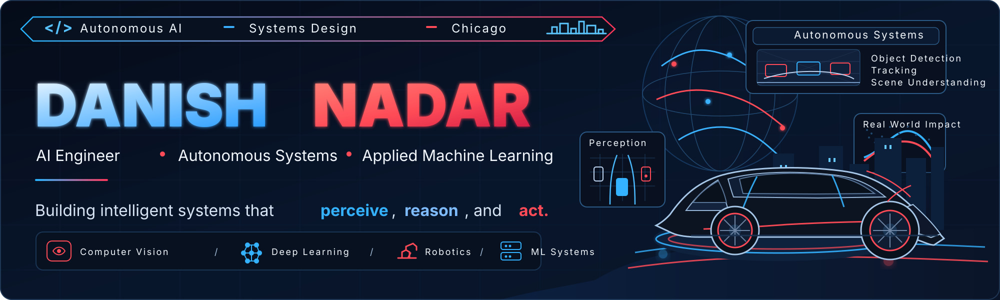
  </picture>
</a>

  
  
  
  
  
  

  <b>AI engineer in Chicago</b> building complete intelligent systems: on-device multimodal inference, LLM compression, perception and tracking for robots and vehicles, and the software and infrastructure that ship them.

  B.S. + M.A.S. in Artificial Intelligence · Data Science minor · Illinois Tech · expected May 2027 · <b>open to AI/ML engineering roles</b>

| At a glance | |
|:--|:--|
| **What I build** | Multimodal and on-device AI · model optimization · perception, tracking and state estimation · full-stack AI products |
| **Strongest evidence** | [TalonCV](#taloncv): five model families running in the browser · [Morph](#morph): LLM depth compression + distillation · [OBSERV-E](#observ-e): StarkHacks 2026 Qualcomm Robotics Track winner · [EcoCAR](#autonomous-systems--robotics): sensor-fusion lead |
| **Leadership** | President, ML @ Illinois Tech · President, Illinois Tech Robotics · NASA Lunabotics autonomy lead · Co-founder & Chief AI Officer |
| **Production instincts** | Static-export inference with no server · row-level security and admin-gated edge functions · infrastructure as code · CI test suites · fail-closed data sync |

  <a href="#engineering-snapshot">Snapshot</a> ·
  <a href="#flagship-systems">Flagship systems</a> ·
  <a href="#autonomous-systems--robotics">Autonomy</a> ·
  <a href="#morph">Research</a> ·
  <a href="#engineering-infrastructure--product-systems">Infrastructure</a> ·
  <a href="#capability-matrix">Capabilities</a> ·
  <a href="#beyond-the-code">Leadership</a> ·
  <a href="#professional-experience">Experience</a> ·
  <a href="#trajectory">Timeline</a> ·
  <a href="#live-engineering-signal">Live activity</a>

## Engineering Snapshot


I like problems that cross the whole loop, from turning raw audio, video and sensor data into representations to deciding and acting on them under real constraints such as latency, privacy, memory and safety. No single project here covers all five stages; together they cover the loop.

## Flagship Systems

### TalonCV

<a href="https://github.com/DanishNadar/TalonCV"></a>

**Problem.** Interview-practice tools usually upload a candidate's video to a server, and those recordings are sensitive. **What I built:** the full pipeline from recording to report, inside the browser. Two Web Workers run speech (Whisper), semantics (MiniLM) and vision (YOLO11-face via ONNX Runtime Web, plus MediaPipe). A time-window alignment step fuses their evidence, and deterministic scoring produces an eight-tab report. **Engineering depth:** I chose quantized model variants (q4/q8), built a cancellable worker protocol, and wrote a Python research twin that trains a random-forest cue classifier. It exports to browser JSON and is checked by parity tests, with typecheck, lint, Vitest and Playwright in CI.

[**Source**](https://github.com/DanishNadar/TalonCV) · [**Live demo**](https://talon-cv-rosy.vercel.app) · [Deployment notes](https://github.com/DanishNadar/TalonCV/blob/main/DEPLOYMENT.md)


### Morph

<a href="https://github.com/DanishNadar/Morph"></a>

**Problem.** Many deployment targets can't hold a model's full depth, and naive truncation throws away late-layer behaviour. **What I built:** an architecture-aware compression CLI. It locates the decoder-block list across common architectures (Llama, Mistral, Gemma, Qwen2, GPT-2, Falcon, OPT, NeoX, MPT), keeps blocks spread uniformly across depth, and copies their weights into a reduced student. The student can then be distilled with masked, T²-scaled KL to a frozen teacher (optionally 4/8-bit quantized), plus cross-entropy and optional hidden-state matching. The output is a standard Transformers checkpoint plus compression metadata. **Honest status:** it's a research prototype. I haven't published benchmark numbers yet; the README defines the evaluation protocol (held-out perplexity, teacher–student KL and agreement, tokens/s, peak memory).

[**Source**](https://github.com/DanishNadar/Morph) · [Distillation objective](https://github.com/DanishNadar/Morph#distillation-objective) · [Evaluating compression](https://github.com/DanishNadar/Morph#evaluating-compression)

<b>Morph architecture and loss</b>

 

### OBSERV-E

<a href="https://github.com/DanishNadar/observ-e"></a>

**Problem.** A guide robot for visually impaired users has to keep a lock on its person and give guidance that is timely and relevant, without narrating constantly. **What we built (team, StarkHacks 2026):** a Python perception stack. It runs YOLO11 person detection, single-target lock and reacquisition, and tracking that falls back from OpenCV trackers to Lucas–Kanade optical flow. A constant-velocity Kalman filter publishes predicted gimbal state at 100–300 Hz between detections. A separate safety loop handles hazard detection, a risk engine and a speech planner that only speaks when the scene changes; an optional asynchronous VLM adds scene narration. Teammates built the STM32WB/IMU firmware and the BLE companion app.

[**Source**](https://github.com/DanishNadar/observ-e) · [**Case study**](https://www.danishnadar.com/projects/observ-e) · [Perception package](https://github.com/DanishNadar/observ-e/tree/main/VLM)

<b>OBSERV-E architecture</b>

 

## Engineering Work by Discipline

### Autonomous Systems & Robotics

<a href="https://www.danishnadar.com/projects/ecocar-sensor-fusion"></a>
<a href="https://github.com/DanishNadar/CS-584-Final-Project"></a>
<a href="https://www.danishnadar.com/projects/rl-autonomous-driving"></a>

- **EcoCAR EV Challenge**: Sensor Fusion Lead on Illinois Tech's connected & automated vehicle team. I write perception requirements and validation test cases, and build real-time C++/RTMaps modules across camera, radar and LiDAR. [Case study](https://www.danishnadar.com/projects/ecocar-sensor-fusion) · [Illinois Tech feature](https://www.iit.edu/student-experience/student-and-alumni-stories/intelligent-systems-safer-roads)
- **Lane detection study**: a reproducible 6-experiment grid (3 backbones × augmentation on/off) that writes per-epoch histories, per-sample metrics, comparison plots and qualitative videos. [Code](https://github.com/DanishNadar/CS-584-Final-Project) · [Case study](https://www.danishnadar.com/projects/lane-detection-salad)
- **RL lane-keeping**: reward design and a sensor-configuration comparison tracking collision rate, off-road rate, lane deviation and completion. [Case study](https://www.danishnadar.com/projects/rl-autonomous-driving)
- **NASA Lunabotics (in progress)**: I lead autonomy software for the team's lunar robotics entry. Competition preparation is ongoing; see [Beyond the Code](#beyond-the-code).

### Applied AI Products

<a href="https://github.com/DanishNadar/ConfusionClassifier"></a>
<a href="https://github.com/DanishNadar/AILA_Avatar"></a>

- **ConfusionClassifier**: turns model uncertainty into a game. Data comes from the official GoEmotions splits mapped to 4 classes; I chose the model by dev macro-F1 − 0.05 × log loss and evaluated once on an untouched test split. Each prediction is explained with TF-IDF × coefficient contributions. [Code](https://github.com/DanishNadar/ConfusionClassifier) · [Live](https://confusion-classifier-chi.vercel.app)
- **AILA**: a voice role-play coach for the Leadership Academy, with 34 scenarios, voice-activity detection, barge-in, and XTTS-v2 speech with a browser fallback. [Code](https://github.com/DanishNadar/AILA_Avatar) · [Live](https://aila-avatar.vercel.app) · [Local Ollama prototype](https://github.com/DanishNadar/AILA)

### Engineering Infrastructure & Product Systems

<a href="https://github.com/DanishNadar/CampGrids"></a>
<a href="https://github.com/DanishNadar/ComputeCollaborative"></a>

- **CampGrids** (Museum of Science and Industry Fab Lab camps): built from an MSI intern's idea. I built the interface, the workbook-to-site sync and the Supabase account layer: row-level security, admin-only provisioning functions, emailed one-time codes for staff, and Realtime navigation. A CloudFormation-defined AWS target is also documented. [Code](https://github.com/DanishNadar/CampGrids) · [Live](https://camp-grids.vercel.app)
- **Compute Collaborative**: the technical and financial case for governed student GPU infrastructure at Illinois Tech. Every cost figure opens its assumptions and sources. [Code](https://github.com/DanishNadar/ComputeCollaborative)

<b>CampGrids architecture</b>

 

<b>More builds</b>

 

| Project | What it is |
|:--|:--|
| [LEAD-AI](https://github.com/DanishNadar/LEAD-AI) · [live](https://lead-ai-eight.vercel.app) | Auditable leadership-outcome reporting: async CampusGroups export client, deterministic semantic read of weekly reports, Neon Postgres. Next.js + TypeScript. |
| [Certeverin](https://github.com/DanishNadar/Certeverin) · [live](https://certeverin.vercel.app) | Maps job-posting skill demand to certification objectives so a club can decide which certifications to fund. FastAPI, Next.js, CLI, PDF export. |
| [Cloud Conglomerate](https://github.com/DanishNadar/CloudConglomerate) | Offline Godot 4 game that teaches cloud and ML system design: architectures appear as constellations you inspect, scale and fail over. |
| [TTP DNS Screening](https://github.com/DanishNadar/TTP_DNS-Screening-Tool) | SPF / DKIM / DMARC screening automation with DNS-over-HTTPS lookups and checkdmarc validation. |
| [ITR Lab Access](https://github.com/DanishNadar/ITR-Lab-Access) · [live](https://itr-lab-access.vercel.app) | Lab-access management for Illinois Tech Robotics. Next.js 14, Neon Postgres, Drizzle ORM. |
| [DanishPortfolio](https://github.com/DanishNadar/DanishPortfolio) · [live](https://www.danishnadar.com) | Source for danishnadar.com: TanStack Start, Supabase CMS, an LLM-backed portfolio guide and a 3D skills experience. |

## Capability Matrix

## Beyond the Code

<a href="https://www.danishnadar.com/student-organizations"></a>

### Professional Experience

| Role | Organization | When | What I delivered |
|:--|:--|:--|:--|
| **Software Automation Engineer** | Technology Transition Paradigm | Aug 2025 – present | Python tooling that screens client domains for SPF / DKIM / DMARC issues, validates the findings against EasyDMARC, and drives Microsoft Graph outreach with test and live send modes. [Code](https://github.com/DanishNadar/TTP_DNS-Screening-Tool) · [Case study](https://www.danishnadar.com/projects/ttp-outreach-automation) |
| **AI Software Development Intern** | OfficePro, Inc. | May – Aug 2025 | AI-instructor prototypes on Azure Speech and Cognitive Services; Python and PowerShell automation for a 50+ machine training fleet; production fixes on a Supabase, Vercel and Stripe AI product. |
| **CAV Engineer → Sensor Fusion Lead** | EcoCAR EV Challenge, Illinois Tech | Aug 2024 – present | Perception requirements and validation test cases; real-time C++/RTMaps modules for lead-vehicle detection and driver monitoring. [Case study](https://www.danishnadar.com/projects/ecocar-sensor-fusion) |
| **Platform engineer** | CampGrids, Museum of Science and Industry Fab Lab camps | 2026 | Interface, workbook sync pipeline and Supabase account system for camp curricula, teachers and campers. [Live](https://camp-grids.vercel.app) |

**Education.** Illinois Institute of Technology: combined B.S. + M.A.S. in Artificial Intelligence, Data Science minor, expected May 2027. Applied coursework in computer vision, NLP and deep learning. Montgomery College: A.A.S. in Cloud Computing & Network Technology (2023). Featured in Illinois Tech's [*Intelligent Systems for Safer Roads*](https://www.iit.edu/student-experience/student-and-alumni-stories/intelligent-systems-safer-roads).

## Trajectory


## Live Engineering Signal

<!-- INSIGHT:START -->
<a href="https://github.com/DanishNadar/ConfusionClassifier"></a>
<!-- INSIGHT:END -->


**Recently active**

<!-- RECENT:START -->
| Repository | What it is | Language | Last push |
|:--|:--|:--|:--|
| [**DanishPortfolio**](https://github.com/DanishNadar/DanishPortfolio) · [demo](https://www.danishnadar.com) | Source for danishnadar.com | `TypeScript` | 2026-10-09 |
| [**LEAD-AI**](https://github.com/DanishNadar/LEAD-AI) · [demo](https://lead-ai-eight.vercel.app) | Auditable leadership-outcome reporting (Next.js, Neon Postgres) | `TypeScript` | 2026-09-29 |
| [**AILA_Avatar**](https://github.com/DanishNadar/AILA_Avatar) · [demo](https://aila-avatar.vercel.app) | Voice role-play leadership coach with barge-in | `JavaScript` | 2026-09-29 |
| [**CampGrids**](https://github.com/DanishNadar/CampGrids) · [demo](https://camp-grids.vercel.app) | Curriculum platform for MSI Fab Lab camps (Supabase, RLS, Edge Functions) | `JavaScript` | 2026-09-25 |
| [**ComputeCollaborative**](https://github.com/DanishNadar/ComputeCollaborative) | Student GPU-infrastructure proposal with cost and workload models | `HTML` | 2026-08-27 |
| [**CloudConglomerate**](https://github.com/DanishNadar/CloudConglomerate) | Godot 4 game that teaches cloud and ML system design | `GDScript` | 2026-08-27 |

_Auto-updated 2026-10-09 by GitHub Actions · forks, archives and coursework stubs are filtered out_
<!-- RECENT:END -->

---

  <b>Building something that has to perceive, reason, and act? Let's talk.</b>  
  <a href="https://www.danishnadar.com">Portfolio</a> ·
  <a href="https://www.danishnadar.com/resume">Resume</a> ·
  <a href="https://www.linkedin.com/in/danish-nadar/">LinkedIn</a> ·
  <a href="https://www.danishnadar.com/contact">Contact</a> ·
  <a href="https://github.com/DanishNadar?tab=repositories">All repositories</a>

<i>Every graphic here is a hand-built SVG generated from <a href="data/profile.json">data/profile.json</a>, with claims traced to public code or danishnadar.com · <a href="docs/DESIGN.md">Design notes</a> · <a href="docs/MAINTENANCE.md">Maintenance</a></i>

