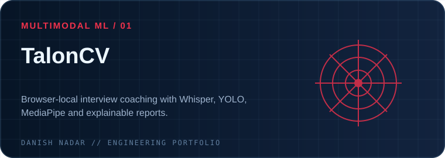
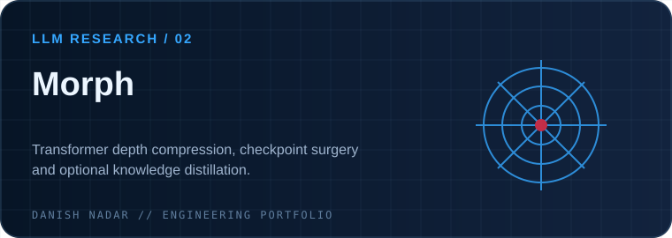
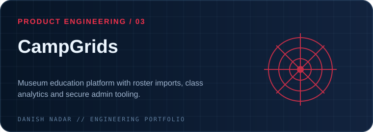
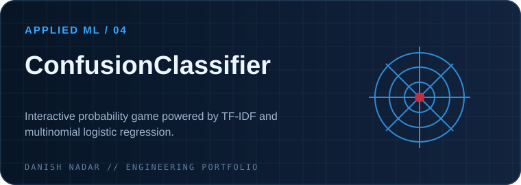
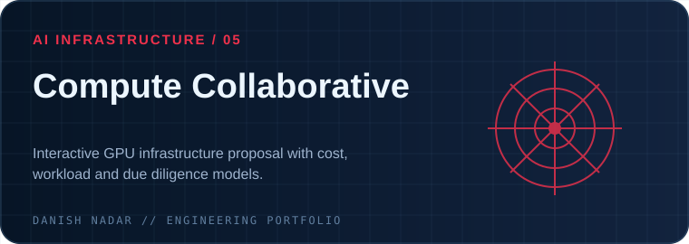
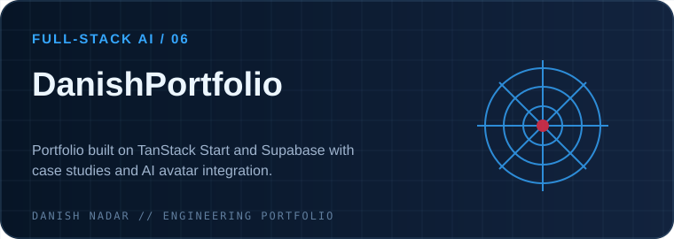
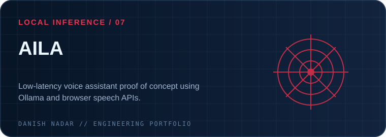
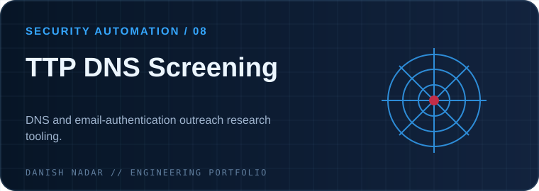

### AI Engineering · Computer Vision · Autonomous Systems · Applied ML

**I build intelligent systems from model research to working software.**

  

**Chicago, IL** · **B.S. + M.A.S. in Artificial Intelligence, Illinois Tech (expected May 2027)** · **Open to AI/ML engineering opportunities**

---

## 01 / Engineering focus

| 👁️ Perception | 🧠 Intelligence | 🛠️ Systems |
|:---|:---|:---|
| Computer vision, multimodal analysis, vision pipelines | Deep learning, NLP, LLM compression, classical ML | Autonomous systems, inference deployment, full-stack AI products |

> **My approach:** prototype against real constraints, make model behavior inspectable, and design the complete path from data to a usable product.

## 02 / Featured engineering work

> Click a project card to inspect its public implementation, architecture and documentation.

<table>
<tr>
<td width="50%"></td>
<td width="50%"></td>
</tr>
<tr><td><b><a href="https://github.com/DanishNadar/TalonCV">TalonCV</a></b> A privacy-oriented, in-browser interview-practice coach. Worker-based inference combines Whisper transcription, semantic analysis, face/pose tracking, and reproducible, explainable scoring. <b>Evidence:</b> architecture and model inventory documented in the repo.</td><td><b><a href="https://github.com/DanishNadar/Morph">Morph</a></b> Research-oriented depth compression of causal LMs, with uniform layer selection, teacher weight transfer, and optional KL/hidden-state distillation. <b>Evidence:</b> runnable CLI and supported model architecture notes.</td></tr>
<tr><td></td><td></td></tr>
<tr><td><b><a href="https://github.com/DanishNadar/CampGrids">CampGrids</a></b> Education platform for camp curriculum navigation, teacher dashboards, CSV roster workflows, student progress, and role-based administration with Supabase.</td><td><b><a href="https://github.com/DanishNadar/ConfusionClassifier">ConfusionClassifier</a></b> An interactive ML teaching experience in which players explore uncertainty in a real four-class TF-IDF + logistic-regression text classifier.</td></tr>
<tr><td></td><td></td></tr>
<tr><td><b><a href="https://github.com/DanishNadar/ComputeCollaborative">Compute Collaborative</a></b> Interactive proposal for governed student GPU infrastructure: configurable bills of materials, cloud comparison, workload explorer, and documented cost assumptions.</td><td><b><a href="https://github.com/DanishNadar/DanishPortfolio">DanishPortfolio</a></b> Full-stack portfolio built with TanStack Start, React and Supabase; includes content management, project case studies and an AI avatar integration.</td></tr>
<tr><td></td><td></td></tr>
<tr><td><b><a href="https://github.com/DanishNadar/AILA">AILA</a></b> Prototype of a low-latency voice assistant using locally served Ollama models, streamed generation, and browser speech APIs.</td><td><b><a href="https://github.com/DanishNadar/TTP_DNS-Screening-Tool">TTP DNS Screening</a></b> Security research and email-domain screening work covering outreach and DNS/email-authentication workflows. See repository for available public material.</td></tr>
</table>

## 03 / Additional systems & research

- **Robotics autonomy & sensor fusion** — perception, localization, mapping, planning, and integration work for an autonomous lunar robotics competition (ongoing team work; no public repository claim).
- **AI product engineering** — co-founder and Chief AI Officer at *A Little Tech For You*, working on practical AI application workflows and local inference. Private code is not linked.
- **Black-hole & fluid simulations** — graphics/physics experimentation using Python, ModernGL and GLSL. See my [portfolio](https://danishnadar.com) for additional background.
- **Selected research and experiments** — [CS584 ML project](https://github.com/DanishNadar/CS-584-Final-Project) · [CS425 project](https://github.com/DanishNadar/CS425_FinalProject_MDJ) · [Propaganda Detection](https://github.com/DanishNadar/PropagandaDetection) · [Coursera review analysis](https://github.com/DanishNadar/CS481_100k-Coursera-Course-Reviews-Dataset)

## 04 / Technical toolkit

| Domain | Tools & methods |
|:--|:--|
| **ML / model development** | Python, PyTorch, scikit-learn, Transformers, ONNX, NLP, model distillation, supervised learning |
| **Computer vision / multimodal** | YOLO, MediaPipe, Whisper, visual/audio analysis, inference pipelines |
| **Application engineering** | TypeScript, JavaScript, React, Next.js, TanStack Start, FastAPI, Streamlit |
| **Infrastructure & data** | AWS, Supabase, SQL, Docker, GitHub Actions, Vercel, local LLM inference |
| **Systems / simulation** | C/C++, robotics fundamentals, ModernGL, GLSL, sensor-fusion concepts |

## 05 / Leadership & experience

**President, Machine Learning @ Illinois Tech** · Student ML community, technical programming and workshops  
**President, Illinois Tech Robotics** · Interdisciplinary robotics collaboration  
**Co-founder & Chief AI Officer, A Little Tech For You** · Applied AI product development  
**AI/Software Engineering Experience** · Real-world platform, automation and research projects

## 06 / GitHub activity

*Public repository statistics are generated by a third-party image service and may occasionally be unavailable.*

---

### Let's build intelligent systems that matter.

[**Explore my portfolio ↗**](https://danishnadar.com) &nbsp; · &nbsp; [**Connect on LinkedIn ↗**](https://www.linkedin.com/in/danish-nadar/) &nbsp; · &nbsp; [**Browse repositories ↗**](https://github.com/DanishNadar?tab=repositories)

Designed around real project evidence · Red / Blue engineering identity · Updated October 2026

